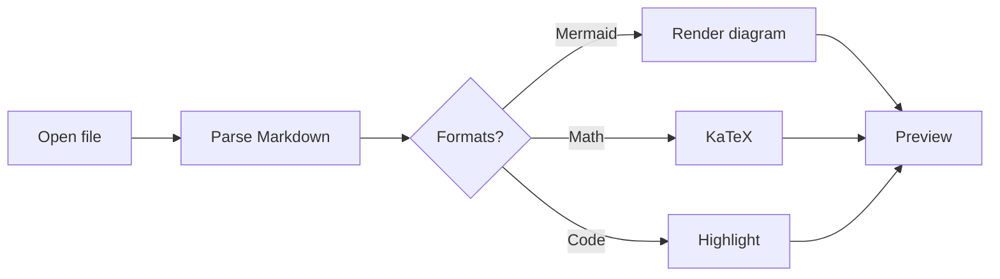
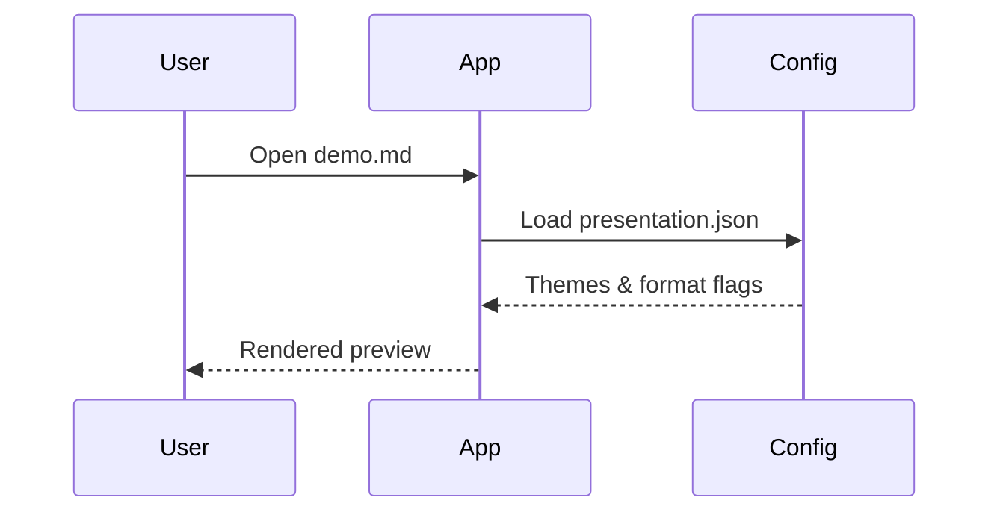
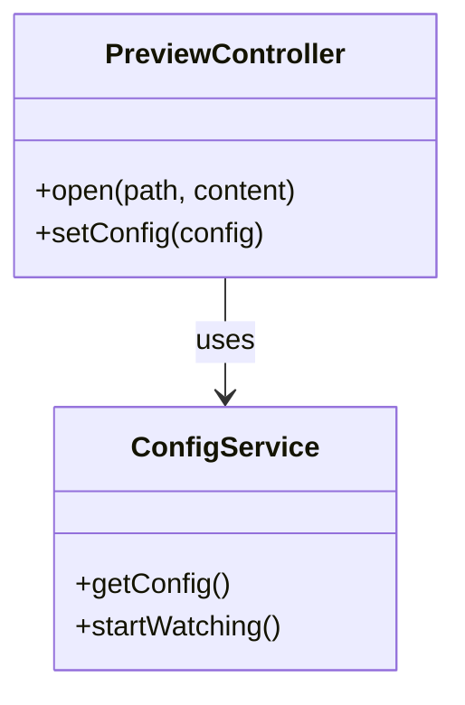

# MarkDown Viewer demo

This sample exercises **standard** Markdown and **non-standard** notations controlled by `presentation.json`.

## Standard formatting

- Bullet lists
- **Bold**, *italic*, ~~strikethrough~~
- `inline code`
- [Links](https://commonmark.org/)

### Task list

- [x] Open a Markdown file
- [x] Render Mermaid graphs
- [x] Customize presentation JSON

### Table

| Feature        | Supported |
|----------------|-----------|
| GFM tables     | Yes       |
| Mermaid        | Yes       |
| KaTeX math     | Yes       |
| Admonitions    | Yes       |

### Currency vs math (`$` handling)

Dollar amounts in table cells must stay **text** (columns and pipes intact). True KaTeX uses `$…$` with TeX, not `$1,202.50`.

| Case | Col A | Col B | Col C | Expect |
|------|------:|------:|:-----:|--------|
| Adjacent currency | $1,202.50 | $48.10 | C | Three columns; both amounts visible as `$…` |
| Thousands + cents | $24,796.80 | $413.28 | A | Commas not eaten; next `$` is not math |
| Two amounts in one cell | $20,000 and $30,000 | — | — | One cell, no math, no red error |
| Phrase then amount | cost $9.99 | $0.00 | B | Opening `$` after a space is currency |
| Real math in a cell | $\pi r^2$ | $12.00 | ok | Col A is KaTeX; Col B is currency |

### After currency table

This heading must remain an **H3** after the table (not swallowed into a cell). Inline math still works: $x = y + 1$.

| Next table | Amount |
|------------|-------:|
| Must not merge with the table above | $8,349.25 |

### Code

```typescript
function greet(name: string): string {
  return `Hello, ${name}!`
}
```

## Admonitions (GitHub-style)

> [!NOTE]
> Notes are good for neutral callouts.

> [!TIP]
> Tips highlight helpful advice.

> [!WARNING]
> Warnings draw attention to risk.

> [!CAUTION]
> Caution is for serious problems.

## Math (KaTeX)

Inline math: the quadratic formula is $x = \frac{-b \pm \sqrt{b^2 - 4ac}}{2a}$.

Block math:

$$
\int_{-\infty}^{\infty} e^{-x^2} \, dx = \sqrt{\pi}
$$

Fenced math:

```math
E = mc^2
```

## Mermaid

### Flowchart



### Sequence diagram



### Class diagram



---

Edit your user config (Help → Open presentation config…) to change theme, fonts, Mermaid theme, or disable formats.
