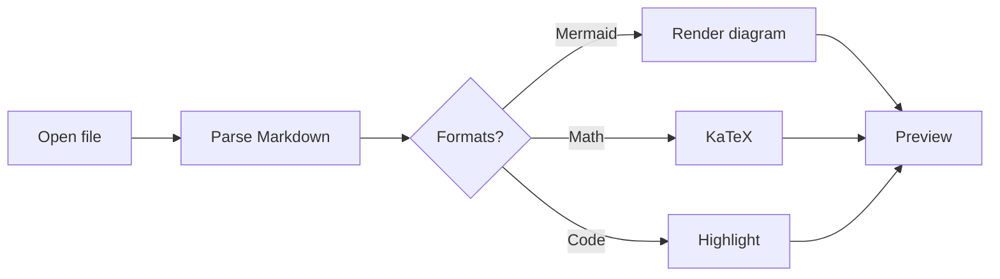
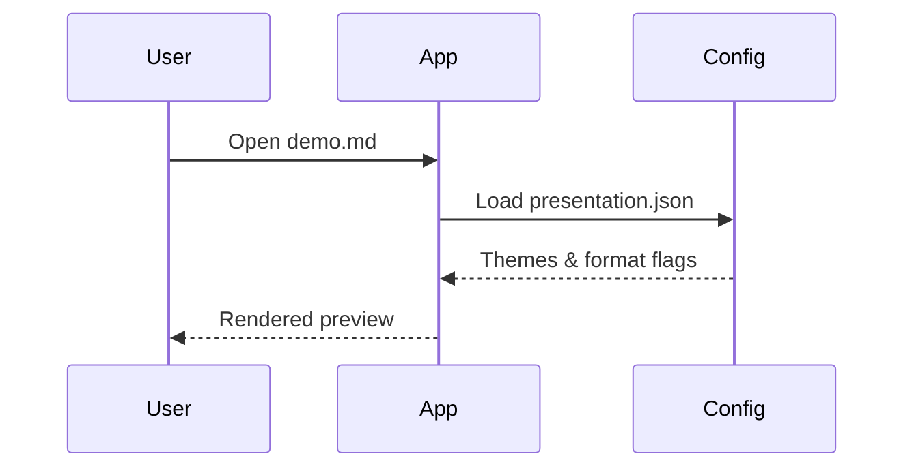
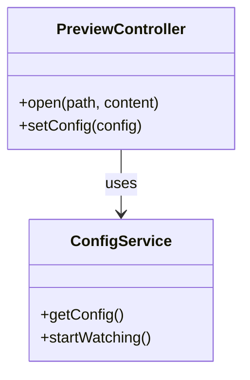

# MarkDown Viewer demo

This sample exercises **standard** Markdown and **non-standard** notations controlled by `presentation.json`.

## Standard formatting

- Bullet lists
- **Bold**, *italic*, ~~strikethrough~~
- `inline code`
- [Links](https://commonmark.org/)

### Task list

- [x] Open a Markdown file
- [x] Render Mermaid graphs
- [x] Customize presentation JSON

### Table

| Feature        | Supported |
|----------------|-----------|
| GFM tables     | Yes       |
| Mermaid        | Yes       |
| KaTeX math     | Yes       |
| Admonitions    | Yes       |

### Code

```typescript
function greet(name: string): string {
  return `Hello, ${name}!`
}
```

## Admonitions (GitHub-style)

> [!NOTE]
> Notes are good for neutral callouts.

> [!TIP]
> Tips highlight helpful advice.

> [!WARNING]
> Warnings draw attention to risk.

> [!CAUTION]
> Caution is for serious problems.

## Math (KaTeX)

Inline math: the quadratic formula is $x = \frac{-b \pm \sqrt{b^2 - 4ac}}{2a}$.

Block math:

$$
\int_{-\infty}^{\infty} e^{-x^2} \, dx = \sqrt{\pi}
$$

Fenced math:

```math
E = mc^2
```

## Mermaid

### Flowchart



### Sequence diagram



### Class diagram



---

Edit your user config (Help → Open presentation config…) to change theme, fonts, Mermaid theme, or disable formats.
